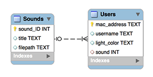

\pagebreak

# Allgemein

## Anforderungen

* Automatische Präsenzerkennung (ohne Interaktion von Fachschaftsmitglied)
* Keine zusätzliche Software/Hardware für Fachschaftler von Nöten
* Webinterface zur Verwaltung
* Zeitnahe Visualisierung der Präsenz (Webseite wie Leuchtsignale)
* individuelle Willkommensmelodie
* Audio-Visuelle Eindeutigkeit der Fachschaftler (Farbe der Leuchtsignale, Melodie beim Eintritt)
* Systemstatus von Außen ersichtlich


## Idee

Da eigentlich jedes Mitglied der Fachschaft ein Smartphone hat, soll die Präsenzerkennung über die Wifi Schnitstelle realisiert werden. Dazu wird ein dedizierter Hotspot, der nur die Fachschaftsräume abdeckt, installiert. Um zu vermeiden, dass auf den Smartphones zusätzliche Software installiert werden muss, soll anhand der MAC-Adresse erkannt werden, ob das Telefon in das spezielle Wifi eingebucht ist und somit der Fachschaftler präsent ist.

Sobald ein Telefon sich ins Wifi einbucht, soll über die in den Fachschaftsräumen installierte Tonanlage die Willkommenmelodie des jeweiligen Telefoninhabers/Fachschaftlers abgespielt werden.

Zusätzlich wird neben der Fachschaftstür ein Leuchtsignal (PixelTube, ein Pixel) mit der vom User spezifizierten Farbe eingeschaltet. Beim Verlassen der Fachschaftsräume soll dieses Signal ausgeschaltet werden.

Durch eine Websocketverbindung auf der Fachschaftswebseite kann nahezu in Echtzeit die Präsenz der Mitglieder von überall eingesehen werden.


## Hardware Komponenten

* Raspberry Pi 2
* WLAN Stick für Hotspotfunktionalität
* ENTTEC DMX USB Pro (DMX Interface)
* Eurolite PixelTube 16 (Leuchtsignal)
* Laustprecher / Kopfhörer
* LEDs zur Visualisierung des Systemstatuses

\pagebreak

# Software Design

Um möglichst effiziente Softwareentwicklungszyklen zu realisieren, wurde großer Wert auf eine maximal modulare Entwicklung der einzelnen Komponenten gelegt.
Die folgende Grafik veranschaulicht den Architekturentwurf:


Der **Webserver**, der **Manager** und der **Wifi Crawler** kommunizieren mittels bi- und unidirektionaler **Queues**.
Die **Peripherie-Steuerung wurde als Library** ausgelegt und wird direkt vom Manager verwendet.
Zwischen Client und Webserver besteht eine bidirektionale Websocketverbindung, damit Präsenzänderungen in Fast-Echtzeit auf der Webseite der Fachschaft angezeigt werden können.
Zusätzlich verwendet das **Verwaltungsinterface eine REST-Schnittstelle**, um User hinzufügen und abändern zu können.
Zugriffe auf die **Datenbank wurden ebenfalls über eine Library gekapselt**.

\pagebreak

## Wifi Crawler

### Hotspot
Die Hotspotfunktionalität wird mit dem Tool **hostapd** und einem zweiten WLAN Stick realisiert. Zusätzlich wurde ein DHCP Server auf dem RaspbberyPi installiert, der den Clients eigene IP Adressen gibt.

	# Installation der benötigten Tools
	$: apt-get install hostapd dhcpd
	
	# Konfiguration von hostapd
	$: cat /etc/hostapd/hostapd.conf
	interface=wlan1
	driver=rtl871xdrv
	ssid=Horst    
	hw_mode=g
	channel=6
	macaddr_acl=0
	auth_algs=1
	ignore_broadcast_ssid=0
	wpa=2
	wpa_passphrase=goto_fail
	wpa_key_mgmt=WPA-PSK
	wpa_pairwise=TKIP
	rsn_pairwise=CCMP
	
Mit der oben angegebenen Konfiguration stellt das RaspberryPi einen Hotspot mit der SSID "Horst" und dem WPA2 Passphrase "goto_fail" zur Verfügung.
	
Im Produktivsystem müsste noch eine **Netzwerkbrücke** zwischen dem Wifi- und dem Ethernetinterface erstellt werden, damit Geräte, die mit dem Raspberry Hotspot verbunden sind, auch weiterhin Internetzugriff haben.
	
### Crawler

Um zu erkennen, welcher User sich verbunden hat, kommt das Tool **iwevent** zum Einsatz. Dieses Tool zeigt alle Ereignisse, die im Hotspot passieren auf der Kommandozeile an. Diese Ausgaben werden von einem Python Programm **geparsed** und an den Manager weiter gegeben. Beispielhafte Ausgabe von iwevent:

	pi@192.168.188.26$: iwevent
	Waiting for Wireless Events from interfaces...
	07:33:44.994303   wlan1    Registered node:8C:3A:E3:17:DF:6C
	07:33:48.866077   wlan1    Expired node:8C:3A:E3:17:DF:6C
	
Glücklicherweise kann iwevent auch als **unprevilegierter Benutzer** verwendet werden, somit ist es nicht nötig dieses Teil der Anwendung mit Root Rechten laufen zu lassen.

\pagebreak

## Statusanzeige GPIO

Zur Anzeige des Systemstatuses wurden zwei LEDs an das GPIO Interface des Raspberry Pis angeschlossen. Eine der beiden Leds zeigt den Start des Managers an. Sie erlischt beim Beenden des Managers.
Die zweite LED visualisiert den Zustand des Wifi Crawlers. Zusätzlich blinkt die LED kurz, wenn ein User sich ins WLAN eingeloggt oder es verlassen hat.

Um zu vermeiden, dass die einzelnen Dienste mit Rootrechten laufen müssen, wurde zur Ansteuerung der GPIOs das **sysfs** Interface verwendet. Dank des Filesystem Mappings ist es möglich, über simple Dateisystemberechtigungen auch unprivilegierten  Nutzern die Verwendung der GPIOs zu erlauben.


## Logging
Um Überblick über das System zu bekommen und etwaiges Fehlverhalten leichter aufdecken zu können, werden an einer zentralen Stelle aus diversen Komponenten Statusmeldungen in ein Logfile geschrieben. Die Log-Nachrichten bestehen dabei aus Datum, Uhrzeit, Art der Nachricht, Dateiname der aufrufenden Systemkomponente, Codezeile, Nachricht.
Nachfolgend ein exemplarischer Auszug des Logfiles:

	2015-05-28 11:36:05,172 INFO: Drei.py (17) Starting Drei
	2015-05-28 11:36:05,172 INFO: InitTables.py (24) Creating table Sounds...
	2015-05-28 11:36:05,173 INFO: InitTables.py (30) Creating table Users...
	2015-05-28 11:36:05,173 INFO: InitTables.py (40) Tables successfully created.
	2015-05-28 11:36:05,265 INFO: Crawler.py (35) Running
	2015-05-28 11:36:05,346 INFO: Manager.py (21) Running
	2015-05-28 11:36:05,348 INFO: SoundController.py (29) Started
	2015-05-28 11:36:05,349 INFO: Periphery.py (24) LightController is connected
	2015-05-28 11:36:05,351 INFO: Webserver.py (31) Webserver: Running on http://127.0.0.1:8080
	2015-05-28 11:36:07,268 INFO: Crawler.py (22) New peer connected: 00:80:41:ae:fd:7e
	2015-05-28 11:36:08,273 INFO: Manager.py (52) user 00:80:41:ae:fd:7e added
	2015-05-28 11:36:08,274 INFO: Periphery.py (39) light 0 turned on
	2015-05-28 11:36:08,277 INFO: Periphery.py (58) sound at Knight-Rider-Theme-Song.mp3 played
	2015-05-28 11:36:08,278 INFO: SoundController.py (32) Loading file Knight-Rider-Theme-Song.mp3
	2015-05-28 11:36:09,372 INFO: Crawler.py (22) New peer connected: 00:80:41:ae:fd:7d
	2015-05-28 11:36:09,373 INFO: Manager.py (52) user 00:80:41:ae:fd:7d added
	2015-05-28 11:36:09,374 INFO: Periphery.py (39) light 1 turned on
	2015-05-28 11:36:09,376 INFO: Periphery.py (58) sound at Windows Error.wav played
	2015-05-28 11:36:09,377 INFO: SoundController.py (32) Loading file Windows Error.wav


## Manager

Der Manager ist in erster Linie für die Abarbeitung der vom Crawler durch die entsprechende Queue gemledeten Ereignisse, d.h. das An- bzw. Abmelden von Usern, zuständig. Hierbei werden bei jeder Änderung die aktuellen Benutzer aus der Datenbank ausgelesen. Anschließend wird, falls es sich um eine Anmeldung handelt, das entsprechende Licht in der vom Benutzer spezifizierten Farbe eingeschaltet und dessen ausgewählter Sound abgespielt. Meldet sich ein Benutzer ab, so wird das dementsprechende Licht gelöscht. Hierzu werden entsprechende Funktionen der Peripherie aufgerufen.
Eine weitere Aufgabe des Managers ist die Abarbeitung der Ereignisse, welche aus dem Webserver durch die entsprechende Queue gesendet werden. Dies betrifft zum einen den Latenz-Test und zum anderen den Last-Test, welche direkt aus dem Browser aus gesteuert werden. Die dort gesetzten Werte werden direkt an die Peripherie weiter gegeben, um die Farbe des dafür vorgesehenen Lichts zu ändern.

\pagebreak

## Datenbank: SQlite



\pagebreak

## Webserver: Flask

Der Webserver wurde mit Hilfe von Flask implementiert. Er ist für die Bereitstellung des Webinterfaces, der REST-Schnittstellen und Websockets verantwortlich. Der Webserver ist standardmäßig unter der Adresse **http://localhost:8080** verfügbar.

Zur Kommunikation mit dem Manager wurden zwei Queues eingerichtet. Eine Queue dient zur Nachrichtenübermittlung an den Manager und eine zum Nachrichtenempfang vom Manager. Erstere dient zur Umstellung der über den Websocket empfangenen Lichtfarbe. Diese wird vom Webserver über den Websocket empfangen und an den Manager weitergeleitet, der daraufhin das Licht in der entsprechenden Farbe anschaltet. Die Queue zum Nachrichtenempfang vom Manager wird genutzt, um Änderungen an den aktiven Benutzern zu empfangen. Als Datenquelle verwendet der Webserver direkt die SQLite Datenbank mit Hilfe des **SQLiteWrapper**s, welcher bereits zuvor vorgestellt wurde.

Die Bereitstellung der Dateien des Webinterfaces wird durch den in Flask intergrierten Webserver übernommen. Dieser stellt alle Dateien unter **static** zur Verfügung. Details zum Webinterface können dem nachfolgenden Punkt entnommen werden.

Die REST-Schnittstelle wurde mit Hilfe der Standardfunktionalität von Flask umgesetzt. Nachfolgende REST-Endpunkte existieren:

URL des Endpunkts				HTTP-Methode	Beschreibung
---------------------------   	------------	----------------
/api/users						GET 			Gibt eine Liste aller Benutzer zurück
/api/Sounds						GET 			Liefert eine Liste aller verfügbaren Sounds zurück
/api/users 						POST 			Legt den als Parameter übergebenen Benutzer an
/api/users/\<string:user_id\>	PUT 			Aktualisiert den Benutzer mit der
												User-Id **\<string:user_id\>**
/api/users/\<string:user_id\>	DELETE			Löscht den Benutzer mit der User-Id
												**\<string:user_id\>**
---------------------------   	------------	----------------

Der zur Verfügung gestellte Websocket-Endpunkt wurde mit der Flask-Erweiterung **flask.ext.socketio** implementiert. Sobald ein Client die Verbindung zu diesem Websocket aufbaut, wird ein Event namens **Connected** ausgelöst. Der Client kann daraufhin folgende zwei Events an den Server senden.

Event 				Beschreibung
----------			----------------
GetActiveUsersEvent	Liefert eine Liste aller aktiven Benutzer zurück
LatencyColorEvent	Nimmt eine Farbe entgegen und setzt reicht diese an den Manager weiter,
					damit dieser ein Licht mit der entsprechenden Farbe anschaltet. Des
					weiteren sendet der Server bei jeder Änderung der Liste mit aktiven
					Usern ein Event namens **ActiveUsersNotification**, welches zusätzlich
					eine Liste der aktiven User enthält. Sobald sich also ein Benutzer
					in das WiFi einloggt oder das WiFi verlässt, wird dieses Event vom
					Server an alle Clients gebroadcasted.

\pagebreak

## Webinterface: AngularJS

Das Webinterface wird über den Webserver bereitgestellt und kann unter **http://localhost:8080/static/drei.html** abgerufen werden. Es handelt sich dabei um eine mit AngularJS entwickelte JavaScript-App, welche die zuvor vorgestellten REST- und Websocket-Endpunkte nutzt.

Die Entwicklung des Webinterfaces geschieht mit der von **yo-angular** bereitsgestellten Build-Umgebung in einem Verzeichnis außerhalb des Python-Entwicklungspfads. Nachdem ein Entwicklungspunkt erreicht wurde, welcher auf dem Webserver bereitgestellt werden soll, so muss zunächst das Verzeichnis **static** im Python-Entwicklungspfad geleert werden. Daraufhin wird im Pfad der Webapp mit **grunt build** der Build gestartet, welcher die Webapp wiederum in das **static** Verzeichnis baut. Daraufhin kann das aktualisierte Webinterface vom Server abgerufen werden.

Die Webapp enthält mehrere Services. Der **DataService** ist verantwortlich für die Kommunikation mit der REST-Schnittstelle des Servers. Dafür werden für die benötigten Endpunkte Methoden zur Verfügung gestellt. Dort auftretende Fehler werden durch den **ErrorHandler** behandelt, welcher Fehler in einem Fehlerdialog darstellt. Zusätzlich steht ein **WebsocketService** zur Verfügung, welcher für die Websocket-Kommunikation mit dem Server verantwortlich ist. Dieser bietet für die vom Server unterstützten Events entsprechende Methoden. Sobald Events empfangen werden, werden diese vom **WebsocketService** in die App gebroadcasted und an entsprechender Stelle in den Controllern behandelt.

Zusätzlich wurden mehrere Controller umgesetzt. Der **DashboardCtrl** ist für das Dashboard verantwortlich und lauscht auf den Broadcast des **WebsocketService**s, um die Liste der aktiven Nutzer aktuell zu halten. Bei der Initialisierung wird zudem ein **GetActiveUsersEvent** an den Server geschickt, damit nicht erst auf eine Änderung gewartet werden muss, um die aktiven Benutzer anzeigen zu können. Der **UsersCtrl** ist verantwortlich für die Ansicht zur Benutzerverwaltung. Er kommuniziert mit Hilfe des **DataServices** mit dem Webserver und empfängt, updated und löscht mit diesem System-User. Ein weiterer Controller ist der **LatencyCtrl**, dieser ist verantwortlich für die Testseite, auf der ein Latenz- und ein Last-Test durchgeführt werden können. Bei ersterem handelt es sich um einen Test der Zeit, die benötigt wird für die Kommunikation von Webserver bis hin zur Peripherie. Dabei kann man auf einem Schieberegler zwischen fünf verschiedenen Farben wählen, was die Farbe des dafür vorgesehenen Lichts ändert. Beim Last-Test werden automatisch 4048 Farbänderungen, in etwa wie beim Latenz-Test, gesendet, allerdings hier in kürzester Zeit. So wird das Verhalten des Systems und der Auswirkungen auf die Kommunikationsgeschwindigkeit unter Volllast getestet. Der entsprechende Controller kommuniziert mit dem **WebsocketService** um die entsprechenden Befehle an den Server zu übermitteln. Zusätzlich existieren noch ein **CreateCtrl** und ein **UpdateCtrl**, welche für das Anlegen bzw. Aktualisieren eines Users verantwortlich sind. Hierfür nutzen sie den **DataService**. Der **ErrorCtrl** dient zur Darstellung eines Fehlers.


## Peripheriesteuerung

### SoundController

### DMXController

\pagebreak

#Tests

## Unittests in Python mit PyUnit

Generelles Setup:

Einbinden der Unittest-Library:
```python
import unittest
```

Erstellen einer Testklasse durch Ableiten von unittest.TestCase:
```python
class TestClass(unittest.TestCase):
```

Falls gewünscht, kann eine testklassenweite setUp-Methode definiert werden, die zu Beginn der Ausführung der Testklasse _einmal_ ausgeführt wird - wird über Annotation `@classmethod` realisiert:
```python
@classmethod
def setUpClass(cls):
	// here be code
```
    		
Falls benötigt, kann eine tearDown-Methode spezifiziert werden, die nach jeder Test-Methode der Klasse ausgeführt wird:
```python    
def tearDown(self):
```
    	
Bei den Unittests zum SQLiteWrapper werden zu Beginn diverse Testuser angelegt und als Objektvariablen definiert, um sie in den Tests später komfortabel nutzen zu können.
In der tearDown() wird sicher gestellt, dass die DB nach der Ausführung einer Testmethode leer ist.

Generell sieht eine Testmethode in PyUnit beispielsweise so aus:

```python
def test_simple_user_adding(self):
	self.assertTrue(self.db_wrapper.add_user(self.testuser))
```

Man kann auch andere assert-Methoden nutzen, den Klassiker         `self.assertEqual(first, second, msg=None)` beispielsweise, der zwei Objekte `first` und `second` mit `==` vergleicht.

## Datenbank-Wrapper
Innerhalb unseres Projekts wurden vor allem für den Datenbank-Wrapper SQLiteWrapper.py Unittests zur Absicherung und Dokumentation der einzelnen Interface-Methoden geschrieben, die regelmäßig zur Ausführung gebracht wurden.

\pagebreak

## Generelle Systemtests
###Webinterface
Das Webinterface zur Benutzerverwaltung wurde durch ausführliche Oberflächentests getestet, indem User anhand der MAC-Adresse ihres Geräts hinzugefügt wurden, geändert wurden und gelöscht wurden. Lief alles durch.

### Peripherie
Die Peripherie-Hardware, bestehend aus Soundausgabe/LED-Bar/Pixeltube, wurde im gleichen Zuge getestet.
Der einfache Positivtest lief erwartungsgemäß gut, das Mobilgerät eines Nutzers wurde vom System sofort bei Einschalten des WLANS am Mobilgerät erkannt, bevor das Smartphone selbst das WLAN des Pi erkannt hat. Die Verzögerung zwischen Systemreaktion und WLAN-Erkennung war nicht wahrnehmbar.

Beim gleichzeitigen Anmelden zweier User werden beide Lichtslots geschaltet, der Sound des ersten Users wird dann abgebrochen und der Sound des zweiten Users abgespielt.

### Crawler
_insert graffel über tests here_


### Lasttests

Es wurden auch Lasttests ausgeführt, bei denen durch schnellen Wechsel der Farbauswahl für den jeweiligen User getestet wurde, wie das System auf eine große Nachrichtenanzahl reagiert.

